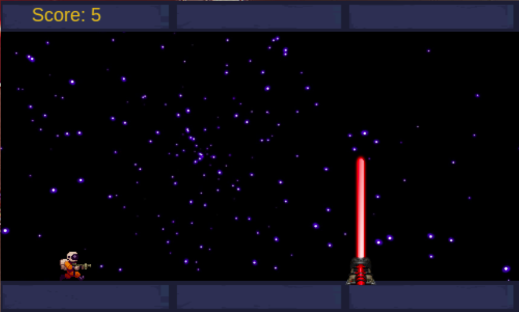

 IronHack-graviton-run-game
> "Graviton Run" is a game built in HTML, canvas, CSS and Javascript.

## Getting Started
If you want to play and share [click here](https://gabrielbohn99.github.io/graviton-run-game/) .

There you will see the instructions for playing below the start button!

:exclamation:For better experience, run this game in a browser on you nootebook or desktop PC. Unfortunatelly this game is not compatible with mobile, **yet**.

## How to Play
Press **START** and then your adventure will begin.

Use the **SPACEBAR** to switch between the gravityes and dodge the lasers.

You have only **1** life. Be careful! 

When you die you have three options to restart: **ENTER**, **SPACEBAR** and the **START BUTTON**.

Good luck and have fun!

## Installation
Clone or download this project, open the index.html file in your browser and have Fun.

## Contributing
You are totally allowed to contribute with this project. To do that, fork this repository, make your changes and create a pull request.
